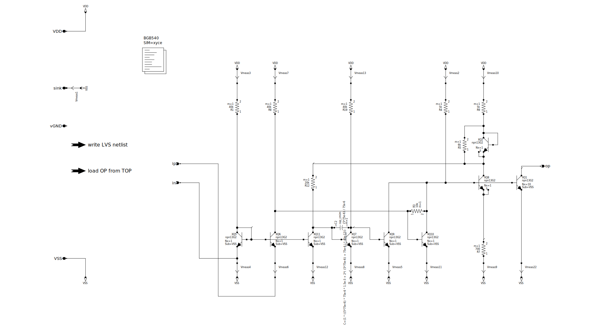
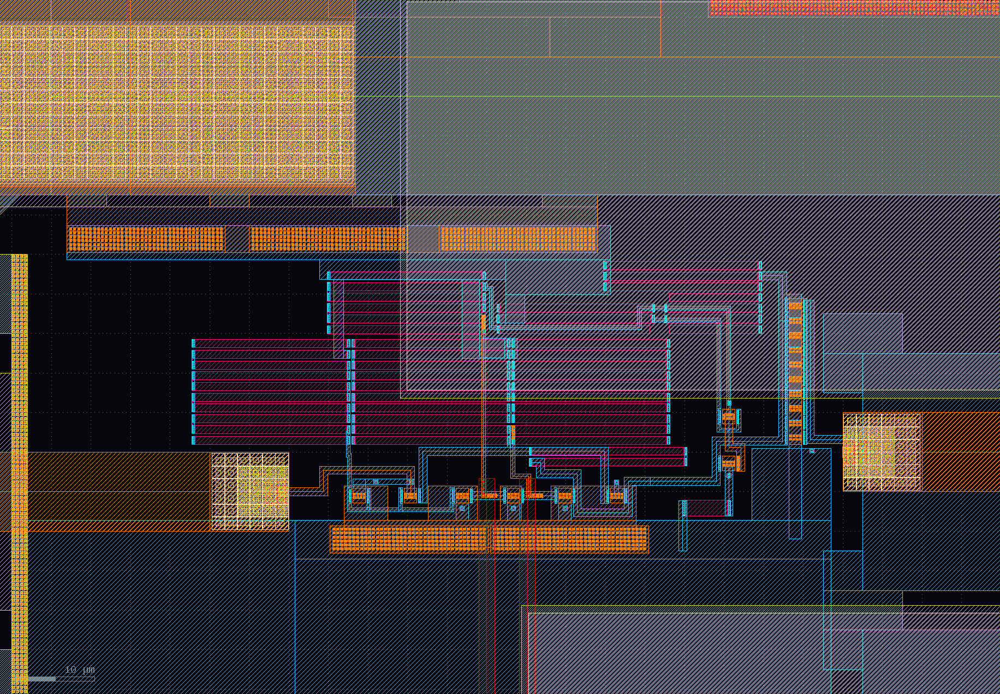
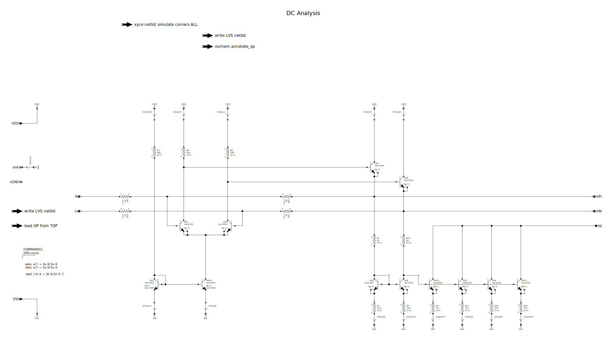
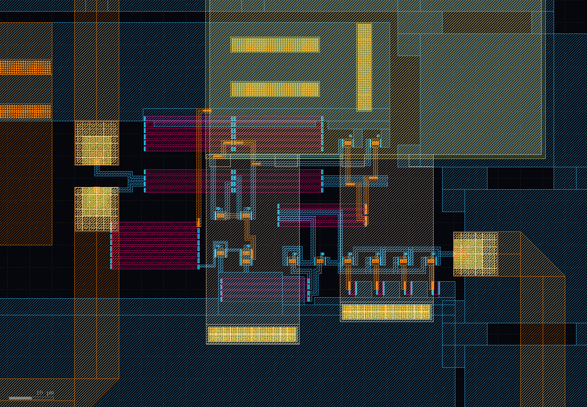
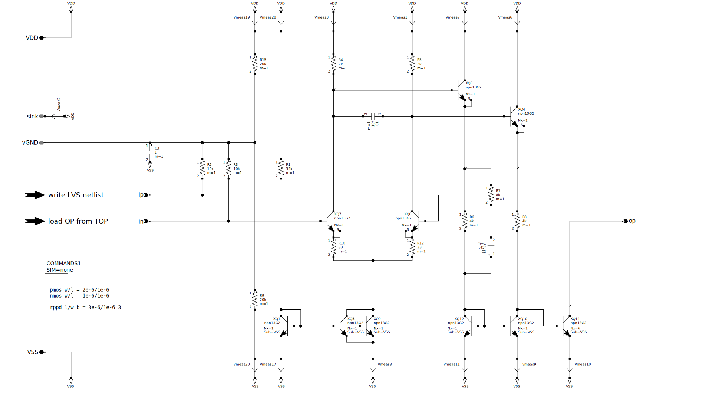
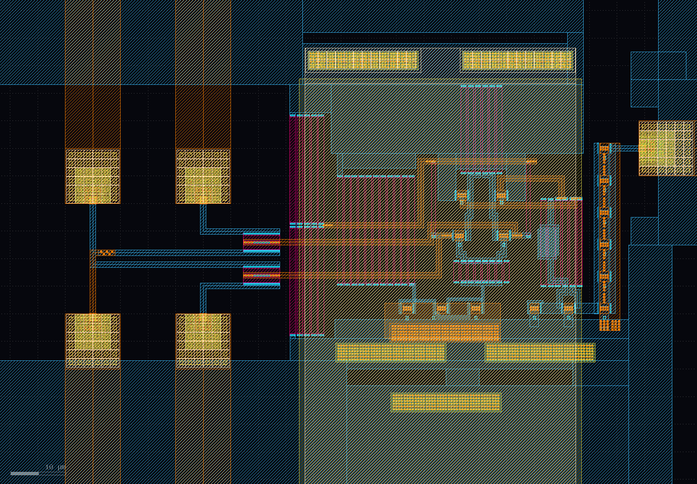

#########
amplifier
#########

schematic
#########

this single input amplifier ist DC-coupled and GND referenced. it drives a laser diode over Q1. its bias current is measured via Q8 and regulated from a norton amplifier build from Q11, Q7 and Q9. the low-pass-corner is set by R12 and C2 (that is also available over test-pads inside the power-ring of the chip). 
the RF-path goes over a base-circuit Q6 to Q10 and Q1. R3 is used to set the gain.
Q2's job is to improve the temperature dependence of the bias-current.

layout
######

the RPPD resistors are layout that way, because i had problems using LVS with resistors and was hoping it works with the simples shape. but in the end, i didn't manage to make LVS work anyway.

######################
differential amplifier
######################

schematic
#########

a simple voltage feedback (R9, R10 to R20, R21) differential amplifier, without common-mode-regulator. the output is converted over a current differencing amplifier (Q5, Q9 and Q14, Q3, Q6, Q11) to a single-ended signal.

layout
######

#################################
dual input differential amplifier
#################################

schematic
#########

a simple current feedback (R10, R12) differential amplifier, without common-mode-regulator. the output is converted over a current differencing amplifier (Q12, Q10, Q11) to a single-ended signal.

the input ip is connected over two 50Ω resistors to both dd+ pads. the input in is connected over two 50Ω resistors to both dd- pads. its thought for compensation circuits that compensate capacitive coupled signals at the input.

layout
######

on the left side of the amplifier the for 50Ω resistors are connected to the input-microstriplines.

########################################
amplifier simulations
########################################

:download:`PDF with Xyce simulation <_static/amplifiers_TB_xyce.pdf>`

