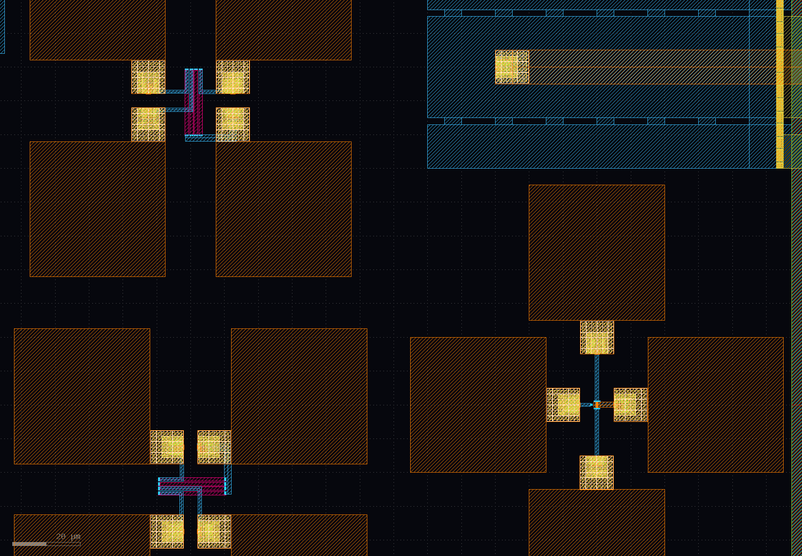

####################
experiments
####################

RPPD
#########

there are 6 resistors aviable to measure: 
3 in X and Y orientations
and both versions as dummy and normal resistors

sg13g2
#######

there is a fast BjT for measurments.

calibration kit
###############

to measure the amplifier impedances and to see the effect of pads and wirebonding, there are an open, short and load calkit.